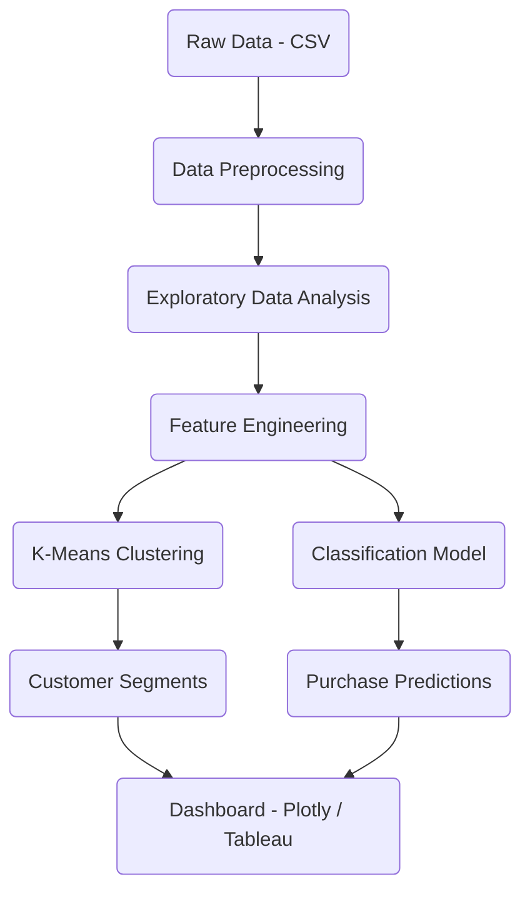
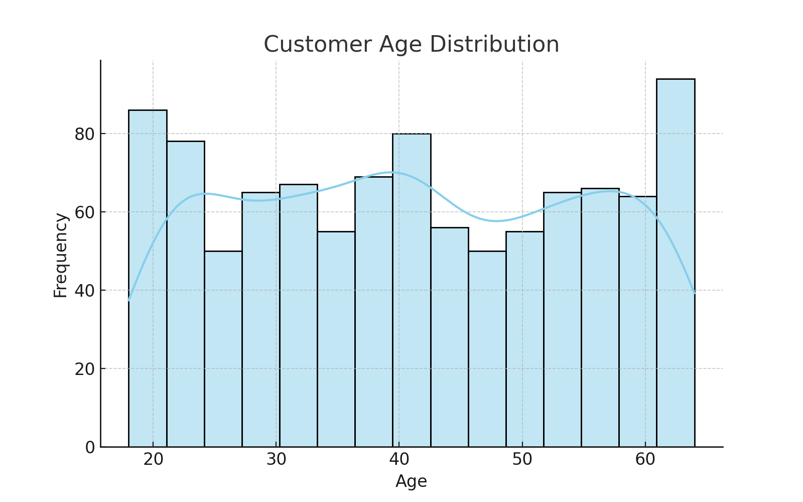
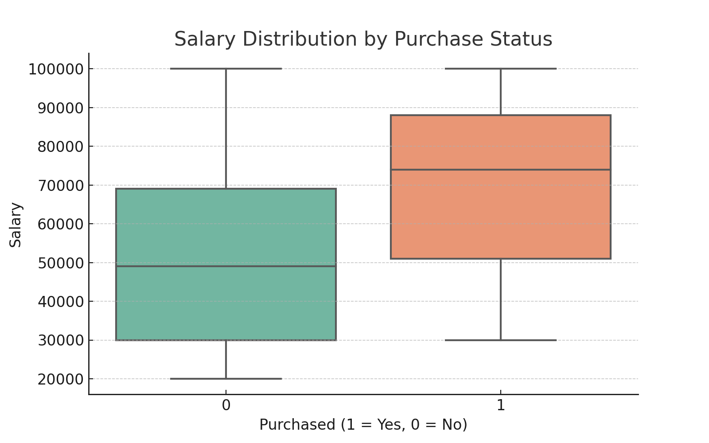
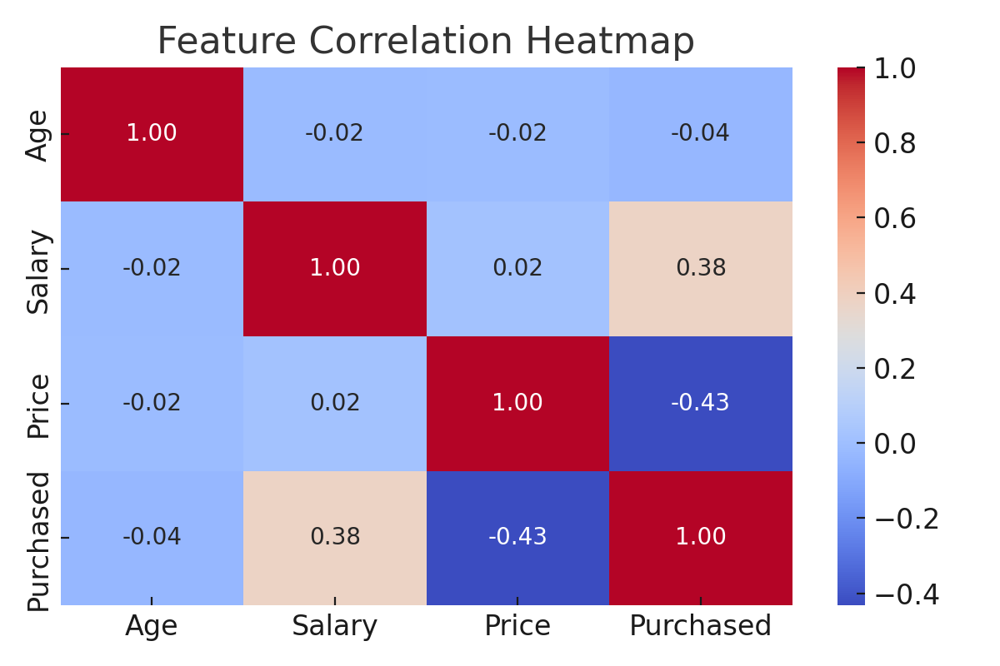
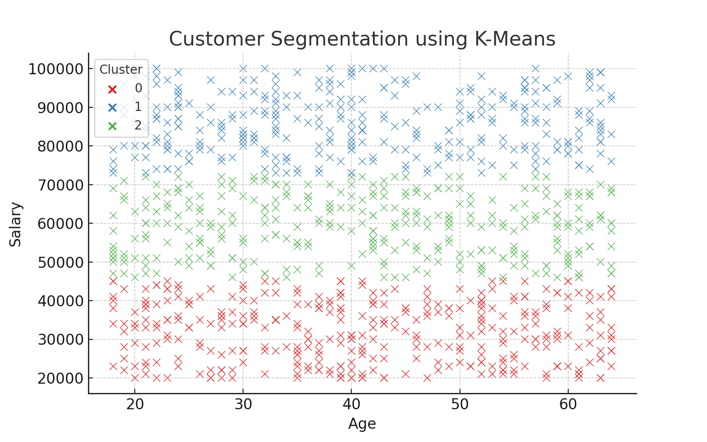
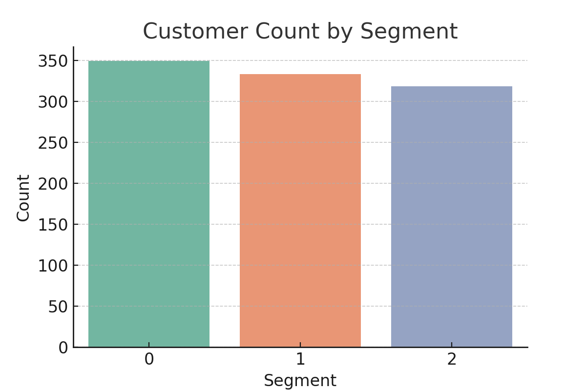

# E-Commerce Customer Behavior Analysis and Segmentation

## Overview

This project analyzes customer behavior within an e-commerce platform to uncover patterns and segment users based on purchasing behavior. The goal is to assist marketing and product strategy teams by identifying distinct customer groups and building models that predict future purchasing trends. The project includes both unsupervised learning for customer segmentation and supervised learning for purchase prediction.

---

## Dataset Description

The dataset `purchase_history.csv` contains the following features:

| Column       | Description                                      |
|--------------|--------------------------------------------------|
| Customer ID  | Unique customer identifier                       |
| Gender       | Gender of the customer                           |
| Age          | Customer's age                                   |
| Salary       | Annual salary of the customer (USD)              |
| Product ID   | ID of the purchased product                      |
| Price        | Product price in USD                             |
| Purchased    | Binary flag: 1 if the product was purchased, 0 otherwise |

---

## Tech Stack

- Python (Pandas, Scikit-learn, Matplotlib, Seaborn)
- Jupyter Notebooks
- Plotly (for interactive dashboards)
- Tableau (optional, for professional visualization)
- PostgreSQL (future scope for database integration)

---

## Project Architecture

---

## Exploratory Data Analysis

### Age Distribution

### Salary by Purchase Status

---

## Modeling Approach

- **Customer Segmentation**: K-Means clustering was applied to identify distinct customer groups based on demographics and purchasing behavior.
- **Purchase Prediction**: A classification model (Random Forest) was trained to predict likelihood of purchase based on input features such as age, salary, and price.

---

## Key Business Insights

- Younger customers tend to have higher purchase frequency in certain salary bands.
- Segmenting users by RFM behavior enables better targeting and customized promotions.
- Predictive modeling allows early detection of likely converters, boosting ROI on ad spend.

---

## How to Run

1. Clone the repository or download the ZIP.
2. Run the notebooks in order:
   - `E-commerce-Customer-Behavior-Analysis-and-Segmentation.ipynb`
   - `Using stratified sampling...ipynb`
3. View outputs in the `images/` directory or generate your own visuals.
4. (Optional) Integrate with Tableau for dashboard publishing.

---

## Future Enhancements

- Integration with PostgreSQL or cloud-based warehouse
- Streamlit dashboard for internal use
- Integration with marketing automation APIs

---

---

## Additional Visualizations

### Feature Correlation Heatmap

### K-Means Segmentation

### Segment Distribution

---
